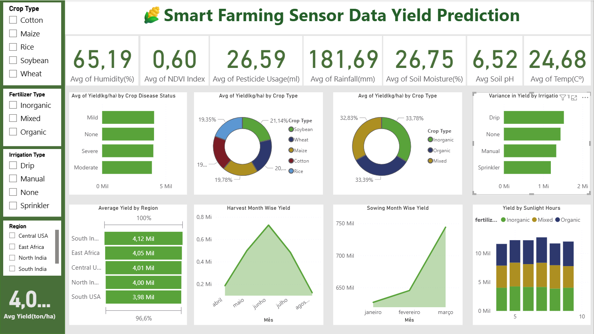

# 🌾 Smart Farming - Crop Yield Dashboard

Power BI dashboard for crop yield analysis using smart farming sensor data.

---

## 📌 Important Note

This project was developed using Power BI in Portuguese, while the dataset and column names are in English.

Because of this language configuration difference, some numeric visual formatting appears in Portuguese notation.  
For example:

- Values that would normally appear as **5K** may appear as **5 Mil**
- Additionally, month names in time-series visuals (e.g., janeiro, fevereiro, março) appear in Portuguese due to the Power BI regional settings.

This does not affect calculations — only the display language.

This does not affect the calculations or data accuracy — only the display format.

---

## 📊 Project Overview

This project analyzes environmental and operational factors that impact crop productivity using a Smart Farming dataset.

The dashboard was built in Power BI to provide interactive insights into:

- Crop yield performance
- Environmental conditions (temperature, rainfall, humidity)
- Soil characteristics (moisture, pH)
- NDVI vegetation index
- Regional productivity comparison

---

## 🎯 Objective

To explore how sensor data and environmental variables influence agricultural yield (kg per hectare) and identify patterns that support data-driven farming decisions.

---

## 📁 Dataset

Dataset: `Smart_Farming_Crop_Yield_2024.csv`

- 500 records
- 22 features
- Includes sensor, climate, soil, and crop health data

---

## 🛠 Tools & Technologies

- Power BI
- Data Modeling
- DAX Measures
- Data Visualization
- Git & GitHub

---

## 📌 Dashboard Features

- Interactive slicers (Crop Type, Fertilizer Type, Irrigation Type, Region)
- KPI cards for environmental averages
- Yield breakdown by disease status
- Time-series yield analysis (Sowing & Harvest Month)
- Correlation-style visual comparisons

---

## 📈 Key Insights

- South India shows the highest average yield (~4.12K kg/ha)
- Yield variation across regions is relatively small, indicating balanced dataset distribution
- NDVI index (~0.60) suggests moderate vegetation health across farms
- Drip irrigation presents the highest yield variance
- Seasonal yield peaks during mid-harvest months
- Soil moisture and rainfall remain consistent contributors to productivity
-Environmental indicators such as NDVI index (~0.60) and soil moisture (~26.7%) show consistent levels across regions, supporting stable yield averages. 

---

## 🖼 Dashboard Preview

---

## 🚀 Future Improvements

- Build predictive model using Python
- Deploy interactive dashboard online
- Add time-series analysis for seasonal yield forecasting

---

## 👨‍💻 Author

João  
Engineering & Data Analytics Enthusiast  
